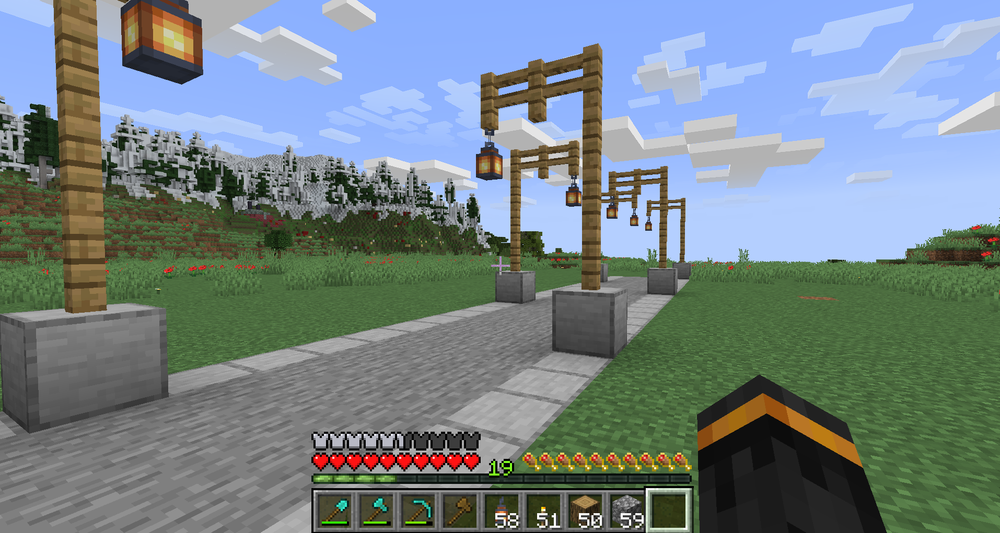
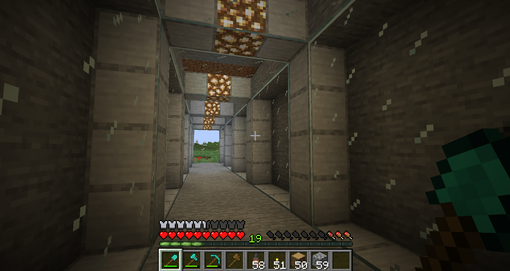

# LazyRoad (Modernized)

A Minecraft plugin that allows you to quickly build complex roads, bridges, and tunnels effortlessly. Just type a command, start walking, and the road will gracefully build itself along your path, adhering to terrain changes!

Originally created by creadri, this project has been fully modernized for modern Minecraft natively supporting the Purpur/Paper API.

## Design Custom Roads & Pillars
**[Open the Interactive Web Designer](designer/index.html)**
LazyRoad now includes an entirely free, offline Web UI designer tool (located in the designer/ folder). This point-and-click editor tool allows you to easily paint road layers, design custom stairs, and build pillar architectures using modern blocks (with built-in support for slabs, orientations, and custom states) which instantly exports ready-to-use JSON configs! 

## Features
* **Live Generation**: Roads assemble themselves dynamically as you walk.
* **Smart Terrain Adapting**: The plugin naturally slopes and traces the landscape via maxGradient rules.
* **Tunnels & Excavation**: Tunnel mode neatly bores precise bounding boxes through mountains with an optional /lr drops toggle to naturally harvest the excavated resources! (Standard roads safely wrap terrain without randomly overwriting dirt paths).
* **Bridges & Suspensions**: Bridge mode actively locks your elevation, building out ahead of you so you can safely traverse ravines. Custom pillars naturally generate dynamically down to the landscape.
* **Arches & Pillar Capping**: Pillars support Build Max Lim configuration, allowing you to explicitly shape hanging arches or construct pillars that naturally snap to solid ground!
* **JSON Templates**: No more binary .ser files. Roads and pillars are completely human-readable. The core templates automatically upgrade alongside the plugin without damaging your custom creations!
* **Directional Block Support**: Modern directional items like Stairs, Lanterns, Logs, and Fences naturally rotate and connect themselves as the road changes directions dynamically.
* **Infinite Undo**: Made a mistake? /lr undo is completely re-engineered to accurately restore landscapes perfectly backwards regardless of road length.
* **Crash-Resistant Safeties**: Making a typo in your JSON configuration (e.g. minecraft:invalid_block) no longer fatally crashes the server engine; the plugin will silently ignore the erroneous block to keep your session alive.

## Commands
* /lr <roadName> - Begin painting a standard road.
* /lt <roadName> - Begin tunneling (smoothly paves and bores through terrain).
* /lb <roadName> <pillarName> - Build a bridge locking your altitude, spawning pillars underneath!
* /lr stop - Stop building.
* /lr undo - Revert the most recently built structure.
* /lr straight - Toggle forcing the road layout perfectly straight (prevents snaking).
* /lr drops - Toggle tunneling excavation drops.
* /lr reload - Reload all JSON setups.

## Gallery
### Tunneling Mode

### Suspension Bridges & Pillars

## Forward Compatibility
LazyRoad has been re-engineered to use dynamic string parsing for block generation rather than hardcoded enums. Because templates are built entirely from strings, the plugin natively supports new Minecraft block versions without ever needing an internal plugin update or SDK recompile! Just enter the correct namespaced ID in your JSON template.

## Credits
Created by creadri, with architecture patches by VeraLapsa and Z5T1. 

*Google DeepMind's Gemini assisted with the 2026 code modernization, UI Web Designer tooling, and JSON architecture migration of this project.*

## License
This project is licensed under the [GNU General Public License v3.0](LICENSE). The original project by creadri has been stated as GPLv3 on the original Bukkit page.