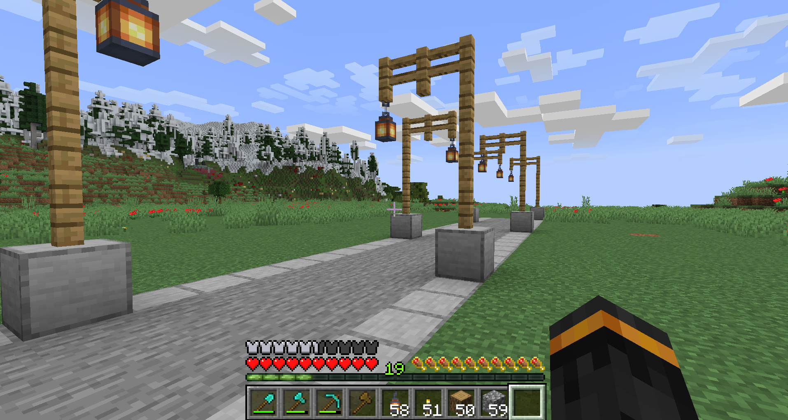
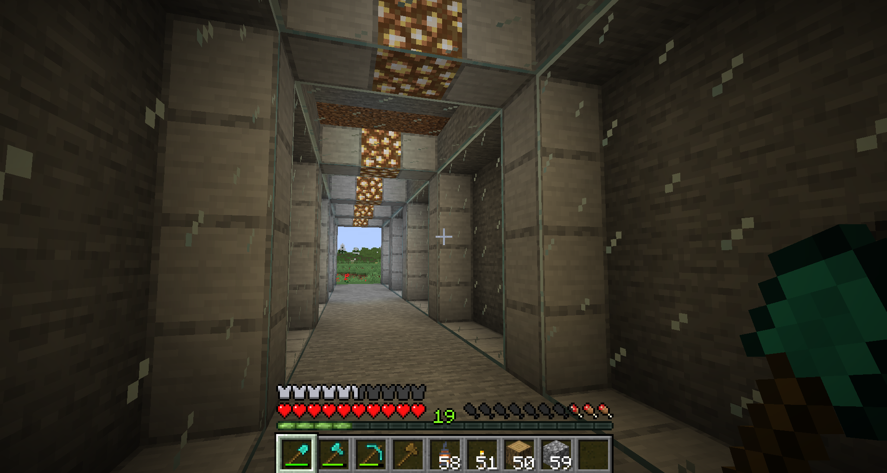
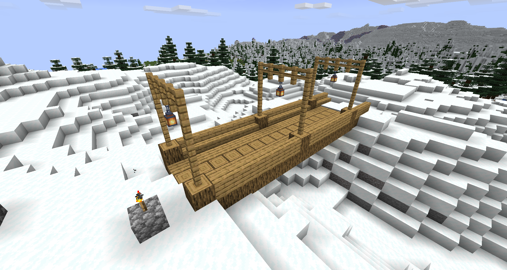

# LazyRoad (Modernized)

A high-performance Minecraft plugin that allows you to quickly construct complex roads, bridges, and tunnels effortlessly. Just choose a template, start walking, and the road gracefully builds itself along your path, dynamically adapting to the terrain!

Originally created by **creadri**, this project has been fully overhauled and modernized for Minecraft 1.21+ targeting Java 21 on Paper and Purpur servers.

---

## Interactive Web Designer
**[Open the Interactive Web Designer (Live on GitHub Pages)](https://countbuggula.github.io/LazyRoad/)**

LazyRoad includes a standalone Web UI designer tool hosted live on GitHub Pages at **[countbuggula.github.io/LazyRoad](https://countbuggula.github.io/LazyRoad/)** (or locally via [`index.html`](index.html)). This point-and-click editor allows you to visually author road layers, design custom stairs, and build multi-part pillar architectures with modern block states (orientations, slabs, hanging lanterns, and corner rotation logic) and instantly export ready-to-use JSON configs!

* **Dynamic Canvas Scaling**: Automatically expands editor dimensions for tall structures ($\ge 13$ blocks) and wide profiles without grid clipping.
* **Scrollable Viewport**: Smoothly navigate large designs with dedicated custom scrollbars while keeping toolbars docked.
* **Drag-to-Paint & Erase**: Hold left-click to paint across multiple cells or right-click to erase continuously. Empty the block input to use the single-click eyedropper tool.
* **Trigger-at-Step Sequencing**: Configure exact step triggers for complex arches and multi-part bridges.

---

## Key Features

* **Dynamic Live Generation**: Roads trace and assemble themselves seamlessly in real time as you walk.
* **Smart Terrain Adapting**: Automatically handles elevation changes and slopes according to `maxGradient` rules.
* **Tunnels & Mountain Boring (`/lt` / `/tunnel`)**: Neatly carves volumetric bounding boxes through mountains and underground caverns without clipping structural surfaces.
* **Synchronized Bridges & Pillars (`/lb` / `/bridge`)**: Locks elevation across ravines and canyons. Bridge decks and multi-part pillar columns advance in exact 1:1 synchronization.
* **Arched & Ground Pillars**: Supports continuous pillars down to solid ground, or bounded drop heights (`buildUntil`) to form hanging archways (such as `Classic5`).
* **LazyMiner Resource Gathering (`/lm` / `/lazyminer`)**: Collects materials excavated during road and tunnel construction into a virtual miner inventory. Designate a chest (`/lm store`) to deposit mined items, with real-time full-container alerts and residual stack counts.
* **Strict Straight Road Mode (`/lr straight`)**: Clamps road generation along cardinal axes (North, South, East, West) to prevent unintentional snaking.
* **Directional Block Auto-Rotation**: Stairs, fences, logs, rails, and hanging lanterns calculate and adjust their block states dynamically as roads turn corners.
* **Infinite Safe Undo (`/lr undo`)**: Accurately reverts structures in reverse chronological order (LIFO), safely restoring original terrain.
* **Human-Readable JSON Templates**: Replaced legacy binary `.ser` files with editable JSON files. Built-in defaults highlight many of the plugin's features and capabilities.
* **Fault-Tolerant Block Placement**: Gracefully ignores unknown or misspelled block IDs without throwing exceptions or interrupting generation.

---

## Commands & Shortcuts

All commands support dynamic tab-completion and auto-fill for subcommands, road templates, pillar templates, and block IDs.

### Road Commands (`/lr` or `/road`)
| Command | Description |
| :--- | :--- |
| `/lr <roadName> [startCount]` | Starts building the specified road template. Optional start count. |
| `/lr stop` *(or `/lr end`)* | Stops active road, tunnel, or bridge building. |
| `/lr undo` | Undoes the last built road, bridge, or tunnel segment. |
| `/lr straight` | Toggles strict cardinal straight mode on/off. |
| `/lr up` | Forces the road/bridge/tunnel elevation to climb upward. |
| `/lr down` | Forces the road/bridge/tunnel elevation to descend downward. |
| `/lr normal` | Resets elevation changes back to automatic terrain-following. |
| `/lr <page>` | Displays a paginated list of available roads and pillars (e.g. `/lr 1`). |
| `/lr reload` | Reloads all road and pillar JSON templates from disk. |

### Tunnel Commands (`/lt` or `/tunnel`)
| Command | Description |
| :--- | :--- |
| `/lt <roadName> [startCount]` | Starts boring a tunnel through terrain using the specified road template. |
| `/lt stop` / `undo` / `straight` / `up` / `down` / `normal` | Tunnel shortcuts share all standard operational subcommands. |

### Bridge Commands (`/lb` or `/bridge`)
| Command | Description |
| :--- | :--- |
| `/lb <roadName> <pillarName> [startCount]` | Starts building a bridge at current elevation with pillars generating underneath. |
| `/lb stop` / `undo` / `straight` / `up` / `down` / `normal` | Bridge shortcuts share all standard operational subcommands. |

### LazyMiner Commands (`/lm` or `/lazyminer`)
| Command | Description |
| :--- | :--- |
| `/lm` | Toggles LazyMiner collection on/off. When enabled, mined blocks are saved. |
| `/lm ids` | Lists all block materials currently tracked and mined by LazyMiner. |
| `/lm addid <block>` | Adds a block material to the LazyMiner collection list. |
| `/lm removeid <block>` | Removes a block material from the LazyMiner collection list. |
| `/lm store` | Deposits accumulated mined blocks into the target chest you are looking at. Alerts you if the chest is full or reports remaining items. |

---

## Permissions

LazyRoad provides granular permissions for server administrators:

| Permission | Description | Default |
| :--- | :--- | :--- |
| `lazyroad.build` | Full administrative access to all LazyRoad and LazyMiner commands. | `op` |
| `lazyroad.user` | Grants access to standard builder commands (`stop`, `undo`, `straight`, `up`, `down`, `normal`). | `op` |
| `lazyroad.lazyminer` | Grants access to all LazyMiner commands (`/lm`, `/lm store`, `/lm addid`, etc.). | `op` |
| `lazyroad.reload` | Allows reloading road and pillar templates from disk. | `op` |
| `lazyroad.road.<roadName>` | Grants access to build a specific road template (e.g. `lazyroad.road.basic`). | `op` |
| `lazyroad.pillar.<pillarName>` | Grants access to build a specific pillar template (e.g. `lazyroad.pillar.basic`). | `op` |

---

## Default Templates Included

### Built-in Roads (`defaultRoads.zip`)
* **`Basic`**: Standard 3-wide lit cobblestone walkway.
* **`BigBridge`**: Multi-part suspension bridge deck designed to pair with the `BigBridge` pillar.
* **`Birch5`**: Clean birch plank and stripped birch log roadway with fences and lanterns.
* **`DiamondWay`**: Decorative luxury road accented with diamond blocks.
* **`GlassTunnel`**: Enclosed glass corridor ideal for underwater or underground pathways.
* **`HighMetro`**: Underground subway tunnel with double rails and elevated walkways.
* **`OuterWall`**: Fortified outer boundary pathway with perimeter railings, pairs with the `OuterWall` pillar.
* **`Simple3`**: Compact 3-wide lit path with tiled edges.
* **`Simple5`**: 5-wide lit trail with tiled edges.
* **`Wall`**: Vertical defensive wall structure, pairs with the `Wall` pillar.
* **`Water5`**: Canal roadway with water channels and walkways.
* **`Wood5`**: Rustic oak plank road flanked by oak logs, fences, and hanging lanterns.

### Built-in Pillars (`defaultPillars.zip`)
* **`Basic`**: 3-wide stone pillar with wider base support.
* **`BigBridge`**: 22-part suspension bridge tower and cable sequence in lockstep with `BigBridge` road.
* **`Classic5`**: Arched bridge support with open under-clearance.
* **`Fence5`**: Open wooden truss pillar.
* **`OuterWall`**: Reinforced stone brick fortification walls.
* **`Round3`**: Rounded 3-wide stone column.
* **`Wall`**: Solid stone foundation walls.

---

## Gallery

### Tunneling Mode

### Suspension Bridges & Pillars

---

## Regression Testing Suite
A comprehensive test suite is available for verifying server features and template generation:
* **Interactive Web Tracker**: `TESTING_CHECKLIST.html` (open directly in any browser for interactive checkbox tracking with automatic local storage save).
* **Markdown Checklist**: `TESTING_CHECKLIST.md`.

---

## Credits & License
Created by **creadri**, with modern architectural updates, Designer tooling, and sequence synchronization by **VeraLapsa** and **Z5T1**.

*Google DeepMind's Gemini assisted with the 2026 code modernization, UI Web Designer tooling, and JSON architecture migration of this project.*

This project is licensed under the [GNU General Public License v3.0](LICENSE).
